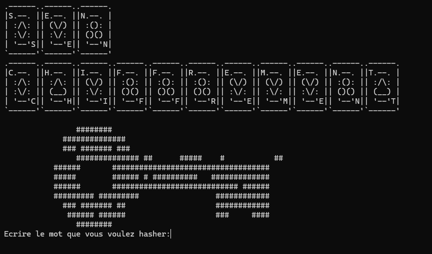

# 🔠CrackProject Java 
CrackProject est une application Java conçue pour démontrer différentes techniques de récupération de mots de passe, notamment :

-🔍 Attaque par dictionnaire: Essaie une liste prédéfinie de mots de passe pour trouver une correspondance

-🧠 Attaque par force brute:Génère toutes les combinaisons possibles de caractères jusqu'à trouver le mot de passe(Zone de Recherche Caractere AlphaNumérique)

-🛠️ Ajout manuel de mots de passe:Permet à l'utilisateur d'ajouter des mots de passe spécifiques à tester.

-⚠️ Avertissement : Ce projet est à but éducatif uniquement. Il ne doit pas être utilisé pour des activités malveillantes ou illégales.

---
## 🎨 Interfaces Utilisateur

### 🏠 Accueil


---

### 🧠 Interface de Force Brute

<div align="center">
  <table>
    <tr>
      <td></td>
      <td></td>
    </tr>
    <tr>
      <td align="center">Menu Interface</td>
      <td align="center">Interface avec les calculs de temps estimés</td>
    </tr>
  </table>
</div>

---

### 📚 Interface de Dictionnaire

<div align="center">
  
  <p>Recherche via une liste prédéfinie</p>
</div>

---

### 🛠️ Ajout manuel de mots de passe

<div align="center">
  <table>
    <tr>
      <td></td>
      <td></td>
    </tr>
    <tr>
      <td align="center">Menu Hash Interface</td>
      <td align="center">Menu Ajout Mot de Passe</td>
    </tr>
  </table>
</div>


## 📁 Structure du projet

-`AjoutPassword.java` : Interface pour ajouter manuellement des mots de passe.

-`BruteForcePasswordCracker.java` : Implémentation de l'attaque par force brute.

-`DictionaryPasswordCracker.java` : Implémentation de l'attaque par dictionnaire.

-`CommandeLine.java` : Interface en ligne de commande pour interagir avec l'application.

-`FileWriter.java` : Utilitaire pour écrire les résultats dans un fichier.

-`InformationPassword.java` : Classe contenant les informations sur les mots de passe.

-`resources/` : Dossier contenant les fichiers de ressources nécessaires.

-`legal/` : Dossier contenant les informations légales et la licence.

---

## ▶️ Lancer l'application

### 🧰 Prérequis

- Java JDK 8+
- Un terminal (ou IDE comme IntelliJ IDEA,VS CODE avec plugin Java ...)
### Étapes

1. Cloner le projet :
```bash
   git clone https://github.com/MrSalifDiallo/CrackProject.git
   cd CrackProject
   ```
2.Compiler les fichiers Java
```bash
javac *.java
```
3.Lancer L'Application
```bash
java Main
```
## 💡Contribution

1. Fork le projet
2. Créer une branche pour votre fonctionnalité (`git checkout -b feature/AmazingFeature`)
3. Commit vos changements (`git commit -m 'Add some AmazingFeature'`)
4. Push vers la branche (`git push origin feature/AmazingFeature`)
5. Ouvrir une Pull Request

## 📄  Licence

Ce projet est sous licence MIT. Voir le fichier `LICENSE` pour plus de détails. 

